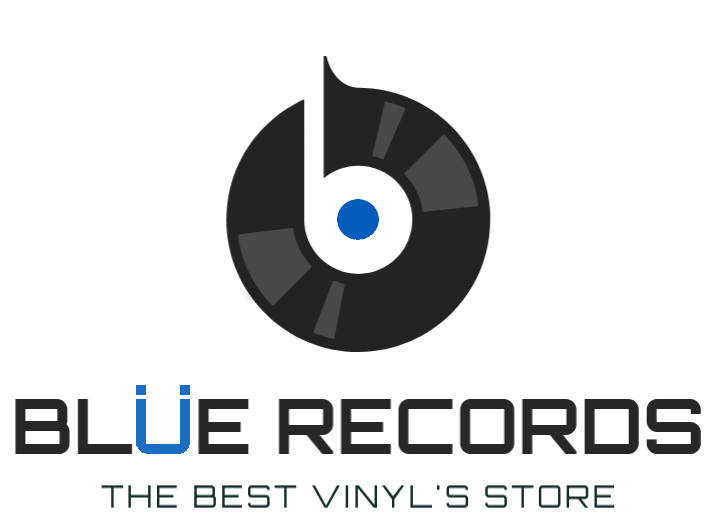

   
<p align="center">
    
</p>

# Blue Records [](https://circleci.com/gh/renanfch/bluerecords)
API para compra e vendas de discos de vinil; 

Stack utilizada:

* Linguagem: [`Java`](https://www.oracle.com/technetwork/java/javase/downloads/index.html) / [`Kotlin`](https://kotlinlang.org) 
* Compilação: [`Gradle`](https://gradle.org)
* Framework: [`Spring Boot`](https://spring.io/projects/spring-boot)
* Cache: [`Caffeine`](https://github.com/ben-manes/caffeine)
* Banco de dados: [`H2`](h2database.com) / [`Flyway`](https://flywaydb.org)
* Documentação: [`Swagger`](https://swagger.io)
* Tests: 
    * Teste de unidade [`jUnit5`](https://junit.org/junit5/docs/current/user-guide/) 
    * Ferramenta para mocks [`Mockk`](https://mockk.io)
    * Ferramenta para cobertura de tests [`Jacoco`](https://www.jacoco.org)
* Deploy: [`Gradle Cargo Plugin`](https://github.com/bmuschko/gradle-cargo-plugin)
* Log: []
* CI / CD: [`CircleCI`](https://circleci.com)

## Arquitetura


A estrutura do projeto foi desenvolvido pensando no conceito do 
[`Clean Architecture`](https://blog.cleancoder.com/uncle-bob/2012/08/13/the-clean-architecture.html), 
que divide a aplicação em módulos:

* **Configuration** - Configurações do Framework, injeção de dependências, define
as implementações e realiza a união do projeto como um todo

* **Core** - Regra de negócio, essa módulo é livre de qualquer tipo de framework
para deixar a regra independente de tecnologia e de fácil manutenção, nessa camada
temos duas vertentes:
    * **entity** - Entidades, objetos que representam o negócio
    * **use case** - Casos de uso do projeto, como um `Service`, implementa 
    funcionalidades e regras especificas de cada funcionalidade.
    * **facade** - Quando é necessário utilizar mais de um useCase ao mesmo tempo, 
    é sugerido utilizar um facade para isolar a complexidade.
    * **command** - São comandos convertidos para executar no core para suportar evolução
    do sistema ao longo do tempo.

* **Data Provider** - Camada responsável em fornecer os dados para o `core`
implementando suas interfaces.

* **Entry Points** - Responsável em fornecer os end-points, essa
camada trata os dados que o usuário envia processa utilizando os `use cases`
do `core` e trata seu retorno.

A idéia de utilizar o `Clean Architecture` é para tornar o sistema
manutenível, testável e flexível a alterações drásticas, atravéz dessa estrutura
também temos um ganho ao lidarmos com várias pessoas alterando o mesmo código; 

## Documentação

**Buscar discos** 

GET http://localhost:9000/disco?generoId={id}&pagina={pagina}&tamanho={tamanho}

Consulta: 

http://localhost:9000/disco?generoId=1&pagina=1&tamanho=50

Retorno: 

```json
{
  "tamanho": 1,
  "total": 50,
  "pagina": 1,
  "objetos": [
    {
      "nome": "A Night At The Opera (Deluxe Remastered Version)",
      "valor": 54.3,
      "mensagem": "Sucesso"
    }
  ],
  "mensagem": "Sucesso"
}
```
      

**Buscar disco** 

GET http://localhost:9000/disco/{id}

Consulta: 

http://localhost:9000/disco/1

Retorno: 

```json
{
   "nome": "McCartney II",
   "valor": 42.44,
   "mensagem": "Sucesso"
 }
```

**Registrar venda** 

POST http://localhost:9000/venda

Envio: 

```json
{
           "date": "18/12/2019",
           "idCliente": 1,
           "registrarVendaItemRequestDTO": [
             {
               "idDisco": 1,
               "quantidade": 1
             }
           ]
         }
```
         
Retorno: 

```json
          {
            "id": 227,
            "mensagem": "Venda registrada com sucesso",
            "totalCashBack": 6.37
          }
```
          
**Buscar vendas** 

GET http://localhost:9000/venda?dataInicial={dataI}&dataFinal={dataF}&pagina={pagina}&tamanho={tamanho}

Consulta: 

http://localhost:9000/venda?dataFinal=01%2F01%2F2020&dataInicial=01%2F01%2F2019&pagina=1&tamanho=2

Retorno: 

```json
{
  "tamanho": 2,
  "total": 10,
  "pagina": 1,
  "objetos": [
    {
      "id": 1,
      "idCliente": 1,
      "dataVenda": "2019-01-01",
      "itens": [
        {
          "idVendaItens": 1,
          "idVenda": 1,
          "idDisco": 1,
          "valor": 10,
          "cashBack": 2
        }
      ],
      "mensagem": "Sucesso"
    },
    {
      "id": 33,
      "idCliente": 1,
      "dataVenda": "2019-01-01",
      "itens": [
        {
          "idVendaItens": 33,
          "idVenda": 33,
          "idDisco": 1,
          "valor": 42.44,
          "cashBack": 21
        }
      ],
      "mensagem": "Sucesso"
    }
  ],
  "mensagem": "Sucesso"
}
```

**Buscar venda** 

GET http://localhost:9000/venda/{id}

Consulta:

http://localhost:9000/venda/1

```json
{
  "id": 1,
  "idCliente": 1,
  "dataVenda": "2019-01-01",
  "itens": [
    {
      "idVendaItens": 1,
      "idVenda": 1,
      "idDisco": 1,
      "valor": 10,
      "cashBack": 2
    }
  ],
  "mensagem": "Sucesso"
}
```


## Documentação dinâmica

O `Swagger` nos proporciona uma documentação dinâmica para os end-points
do projeto, também nos dando liberdade para efetuar execuções.


Link: [http://localhost:9000/swagger-ui.html]


## Observações
Tentei utilizar o mínimo de frameworks e bibliotecas possíveis, poderia ser utilizado JPA para persistência e paginação.
O desenvolvimento foi iniciado com Kotlin, mas por se tratar de uma vaga para JAVA preferi fazer o core e os entrypoint em JAVA.
